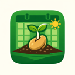

# GardenPlanner

A native macOS app for managing your vegetable garden — track your seed inventory, plan sowing dates, log what you plant, and map out your garden beds. Built with SwiftUI, Swift 6, and Swift Package Manager. Requires macOS 14+.



---

## Features

- **Seed Catalogue** — store everything about each seed: variety, supplier, stock count, sowing windows, spacing, spread, germination info, tags, and notes
- **Sowing Calendar** — a year-at-a-glance grid showing when each seed can be sown, with optional frost-relative windows. Actual sowing dates from your Planting Log are overlaid as dots so you can see at a glance whether you sowed on time
- **Planting Log** — a timeline view showing every sowing as a marker on a year-long track, one row per seed. Click a marker for full details; right-click to delete. After logging a planting to a garden bed, the app navigates there automatically
- **Garden Beds** — drag-and-drop bed planning on a square-grid map. Each cell shows the seed's colour, name, and (if spread is set) a circle showing how much room the mature plant needs. Cm-distance coordinates in each cell match up with a tape measure in the real bed. Cursor-anchored zoom via trackpad pinch, ⌘-scroll, or toolbar buttons
- **Mobile access** — a built-in web server serves a mobile-friendly page over your local network (or via [Tailscale](https://tailscale.com)), so you can log plantings and update bed maps from your phone while standing in the garden, with no app install required

---

## Installation

Clone the repo and run the build script:

```bash
git clone https://github.com/jon23cooper/GardenPlanner.git
cd GardenPlanner
./build-and-install.sh
```

This builds a release binary, assembles a proper macOS app bundle with the icon, ad-hoc signs it, and installs it to `/Applications`. After that, launch from Spotlight (⌘Space → "Garden Planner") or Finder.

**Requirement:** Xcode must be installed. The build script expects Xcode at `/Volumes/ORICO/Applications/Xcode.app` — update the `XCODE` path at the top of `build-and-install.sh` if yours is elsewhere.

To update after pulling new changes:

```bash
./build-and-install.sh
```

---

## Data

All data is stored locally in a single JSON file:

```
~/Documents/GardenPlanner/Data/garden.json
```

Nothing is sent anywhere. Back it up alongside your other documents.

---

## Mobile access

GardenPlanner includes a small HTTP server that serves a mobile web UI. To use it from your phone:

1. Install [Tailscale](https://tailscale.com) on both your Mac and phone and sign in with the same account
2. In the app, open **Settings → Mobile Web Access** and enable the web server
3. Copy the `100.x.x.x` URL shown and bookmark it in your phone's browser

The mobile UI has tabs for logging plantings, recording transplants, browsing your seed stock, and viewing/editing your bed maps. Everything saves directly into the same `garden.json` the desktop app uses.

---

## Documentation

- [User Guide](USER_GUIDE.md) — full walkthrough of every feature
- [Developer Guide](DEVELOPER_GUIDE.md) — architecture, build system, extension conventions, and known quirks
